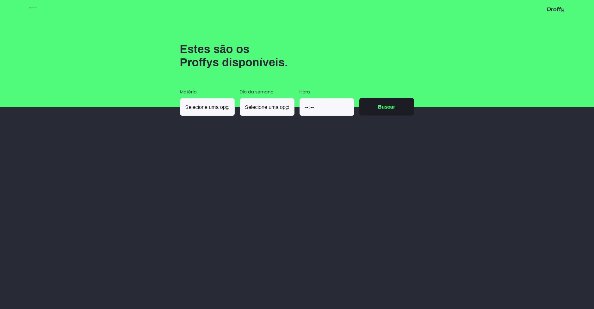
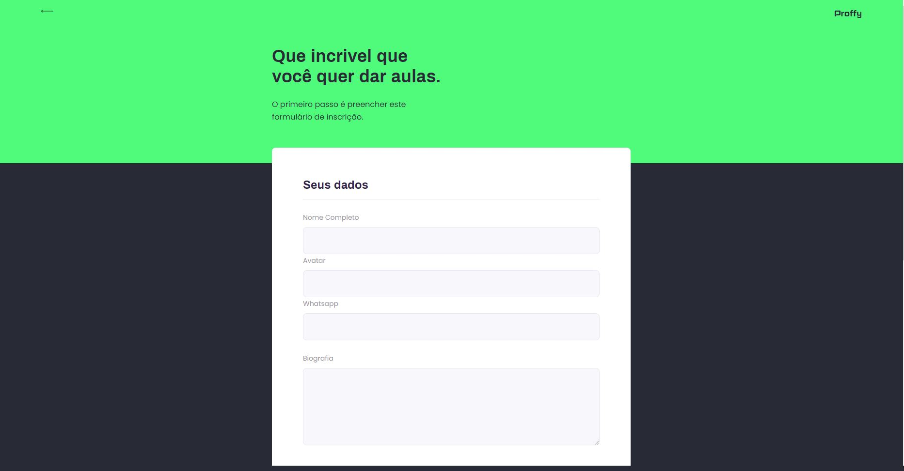
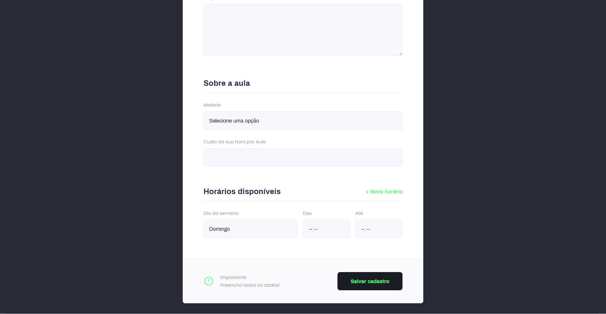
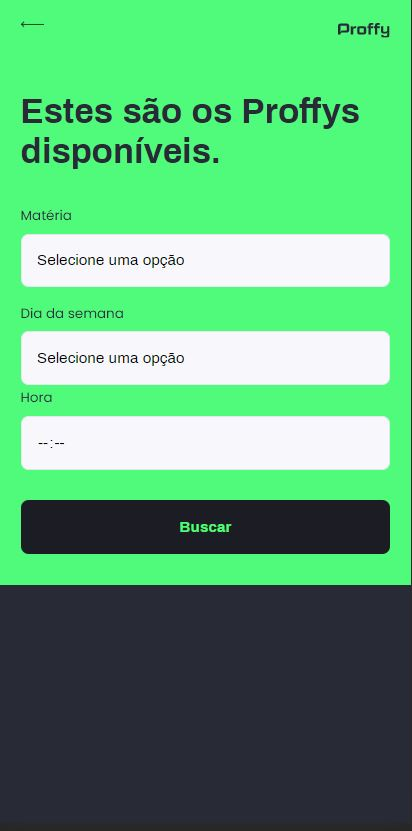
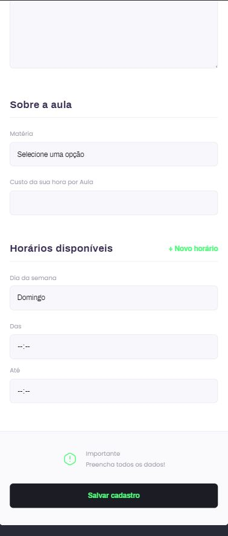

# Proffy
> Projeto criado pela [Rocketseat](https://rocketseat.com.br) no evento Next Level Week #02.


Proffy é uma aplicação onde os professores se cadastram informando seu whatsapp, valor da hora/aula e a matéria a qual são especializados e os alunos buscam os professores pela matéria, dia da semana e horário disponivel, onde é possivel a utilização do mesmo back-end para o front-end web e mobile.


## Ferramentas Utilizadas

Para poder vizualizar o projeto funcionando precisamos destas ferramentas:

- [x] Yarn
- [x] NodeJS
- [X] Expo

***
## Screen Shots das telas

### Versão Web - Desktop


### Versão Web - Find-Proffy



### Versão Web - Give-Classes-1



### Versão Web - Give-Classes-2



### Versão Mobile - Desktop


### Versão Mobile - Find-Proffy



### Versão Mobile - Give-Classes-1


### Versão Mobile - Give-Classes-2



***
## Vizualização
O projeto é formado por 3 camadas, WEB, MOBILE e BACK-END, onde a parte front-end do projeto encontra-se neste repositório em branchs separadas e a parte do BACK-END encontra-se [neste](https://github.com/sirwhod/Proffy-Back-end) .

Para poder vizualizar o projeto completo é necessário a junção dos dois repositórios, siga o passo a passo do README.md do repositório [Proffy BACK-END](https://github.com/sirwhod/Proffy-Back-end)
após isso siga o passo a passo abaixo.

### WEB
Para poder vizualizar o projeto web, siga estes passos:

- Faça o download do projeto
- Dentro da pasta do projeto rode o seguinte comando:

```sh
    yarn
```
Este comando irá instalar as dependencias do projeto.

- Logo após a instalação, rode o comando:

```sh
    yarn start
```
Este comando irá iniciar o projeto abrindo uma página web com o endereço [http://localhost:3000](http://localhost:3000) e assim você poderá vizualizar a aplicação web.
***
### MOBILE

Para poder vizualizar o projeto mobile é necessário o app expo instalado em seu dispositivo Android ou IOS após isto siga estes passos:

- Dentro da pasta do projeto rode o seguinte comando:

```sh
    expo
```
Este comando irá instalar as dependencias do projeto.

- Logo após a instalação, rode o comando:

```sh
    expo start
```
Este comando irá iniciar o projeto abrindo uma página web com o endereço [http://localhost:190001](http://localhost:190001), após a abertura da página scaneie o QRCODE com a câmera do seu celular,
isto fará com que o seu celular comece o download e a conversão do código para a linguagem nativa do seu celular.

É importante saber que o seu celular e o computador onde o expo está sendo rodado precisam estar na mesma rede, caso contrário o aplicativo não irá iniciar.

***
## Meta

Rodrigo Brandão –  rodrigo.brandao98@gmail.com

[https://github.com/sirwhod/proffy](https://github.com/sirwhod/)


This project was bootstrapped with [Create React App](https://github.com/facebook/create-react-app)


## Leia mais

Você pode ler mais em [Create React App documentation](https://facebook.github.io/create-react-app/docs/getting-started).

Para ler sobre o React, leia mais em [React documentation](https://reactjs.org/).